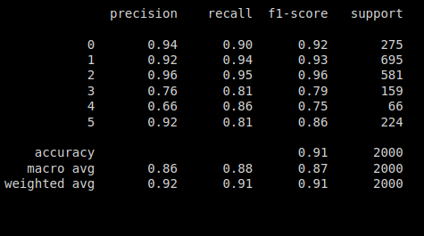

# Tensorflow Extended Emotion Detection Model

## Model

Model is built using TFX pipeline.


The input data is transformed in the graph using TFX transform for better dependency management and faster prediction. The model is trained using TFX trainer. The model is deployed using TFX pusher and served using TF serving. The model is tested using TFX evaluator.  


## Data
This is the <a href="https://huggingface.co/datasets/emotion">emotion dataset</a>. Emotion is a dataset of English Twitter messages with six basic emotions: anger, fear, joy, love, sadness, and surprise.

text: a string feature.

label: a classification label, with possible values including sadness (0), joy (1), love (2), anger (3), fear (4), surprise (5).

## Evaluation
**Classification Report**




## Run
To train the model:

bash run.sh:
```sh
    $ python -m venv .venv
    $ source .venv/bin/activate
    $ pip install -r requirements.txt
    $ python run_pipeline.py
```
